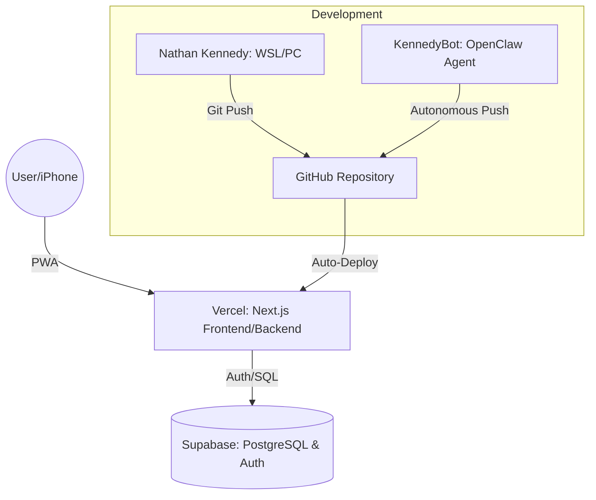

# 🏗️ Iron-Mind AI: System Architecture

GitHub natively renders the diagram below using Mermaid.js.

## 🛠️ Technology Stack

| Layer | Technology |
| :--- | :--- |
| **Frontend** | Next.js 15+ (App Router), React 19 |
| **Styling** | Tailwind CSS, Lucide Icons |
| **Backend** | Supabase (Serverless Functions) |
| **Database** | PostgreSQL (Supabase) |
| **Auth** | Supabase Auth (Google/Email) |
| **Hosting** | Vercel |
| **Dev Ops** | GitHub Actions / Vercel Integration |

## 🔄 Data Flow
1. **Training:** User logs a set on iPhone -> Next.js updates local state -> Supabase stores workout log.
2. **Analysis:** Next.js fetches history -> Core Logic (iron-logic.ts) calculates PR breakthroughs -> UI updates.
3. **Security:** Every request is verified via Supabase Row Level Security (RLS).
